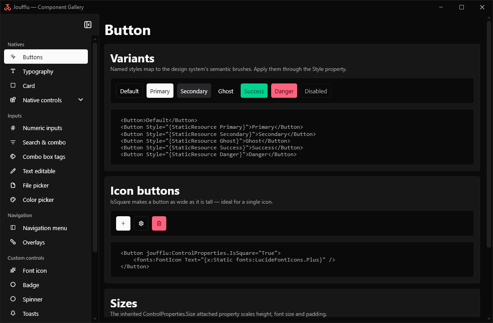

# Joufflu

**A modern WPF component library that makes your desktop apps look good by default.**

Joufflu gives .NET WPF apps a cohesive set of inputs and reusable controls built
on a design system of themed brushes, dimensions and layout helpers. Every
control reads its colours through `DynamicResource`, so the whole UI re-themes
live between Light and Dark — no restart, no flicker.

[](https://www.nuget.org/packages/Joufflu)
[](https://www.nuget.org/packages/Joufflu.Inputs)
[](https://www.nuget.org/packages/Joufflu.Navigation)
[](./LICENSE)



## Highlights

- 🌗 **Live Light / Dark theming** — flip the theme at runtime and every control follows instantly.
- 🎨 **A real design system** — semantic colours, dimensions, sizing and spacing exposed as override-able resource keys.
- 🧩 **Ready-to-use inputs** — numeric, decimal and timespan pickers, searchable and tag combo boxes, file and colour pickers, inline-editable text.
- 🧭 **Navigation & overlays** — a navigation menu, a view-model-first page container and awaitable modal dialogs.
- 🪟 **Custom-chrome window & natives** — a themed application shell plus restyled built-in WPF controls that match out of the box.
- 📦 **Modular packages** — take just the core styles, or add inputs and navigation only where you need them.

📖 **Full documentation:** <https://ndegheselle.github.io/Joufflu/>

## What's inside

| Section | Contents |
|---|---|
| **Inputs** (`Joufflu.Inputs`) | `NumericUpDown`, `DecimalUpDown`, `TimeSpanPicker`, `FormatTextBox`, `Search`, `ComboBoxSearch`, `ComboBoxTags`, `TextEditable`, `FilePicker`, `ColorPicker` |
| **Navigation** (`Joufflu.Navigation`) | `NavigationMenu`, `NavigationContainer` and modal overlays driven by a `Navigator` |
| **Custom controls** (`Joufflu`) | `FontIcon`, `Badge`, `Spinner`, toasts |
| **Toolkit** (`Joufflu`) | Sizing and spacing attached properties, `ThemeManager`, live theme customization, and the application shell (`ThemedWindow`) |

The **Natives** — WPF's built-in controls (buttons, text boxes, combo boxes,
data grid, …) restyled to match the design system — come along with the core
`Joufflu` styles.

## Getting started

1. Add the packages you need. `Joufflu` is the core (styles & theming);
   `Joufflu.Inputs` and `Joufflu.Navigation` are optional and both build on it:

   ```sh
   dotnet add package Joufflu
   dotnet add package Joufflu.Inputs      # optional: input controls
   dotnet add package Joufflu.Navigation  # optional: navigation & overlays
   ```

2. Merge the control styles in `App.xaml`:

   ```xml
   <Application.Resources>
       <ResourceDictionary>
           <ResourceDictionary.MergedDictionaries>
               <ResourceDictionary Source="pack://application:,,,/Joufflu;component/Resources.xaml" />
           </ResourceDictionary.MergedDictionaries>
       </ResourceDictionary>
   </Application.Resources>
   ```

3. Initialize the theme manager once at startup, before the first window shows:

   ```csharp
   // App.xaml.cs — OnStartup
   ThemeManager.Instance.Initialize();
   ```

4. Use the controls as shown in the [documentation](https://ndegheselle.github.io/Joufflu/).

### Design system

The design system is exposed as resource keys you can override in your own
dictionary (merged **after** the Joufflu resources):

- **Colours / brushes** — `joufflu:Colors.*` and `joufflu:Brushes.*`, including
  the semantic families (primary, secondary, success, info, warning, danger).
- **Dimensions** — `joufflu:Dimensions.*` (corner radius, border thickness,
  spacing, control heights, font sizes and padding per size).

Run the gallery and open **Customize theme** to tweak these interactively and
generate a ready-to-merge dictionary.

## Running the samples

- Created with Visual Studio Community 2022, requires the *.NET Desktop
  development* workload.
- Open `Joufflu.sln` and start the `Joufflu.Samples` project to explore
  every control, theme and toolkit helper interactively.

## Acknowledgments

- [Lucide](https://lucide.dev/) icon font
- [CommunityToolkit.Mvvm](https://www.nuget.org/packages/CommunityToolkit.Mvvm) for MVVM boilerplate

I know [Extended WPF Toolkit](https://github.com/xceedsoftware/wpftoolkit) has
already done all the inputs and much more, but you can't fully appreciate
something without knowing how hard it is to do.
